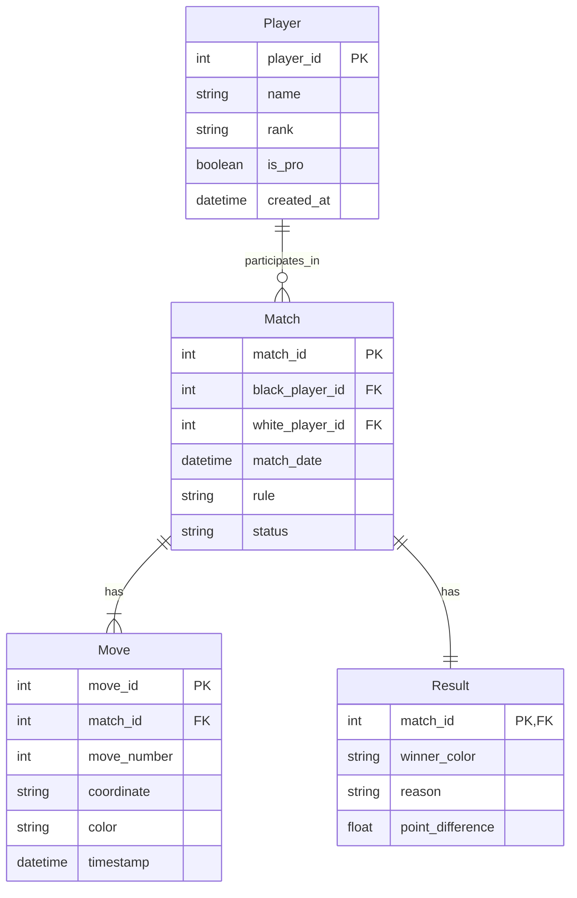

## ERD 설명

### 기본키(Primary Key)
- `Player`: `player_id` (AUTO_INCREMENT)
- `Match`: `match_id` (AUTO_INCREMENT)
- `Move`: `move_id` (AUTO_INCREMENT)
- `Result`: `match_id` (Match 테이블과 1:1 관계)

### 외래키(Foreign Key)
- `Match.black_player_id` → `Player.player_id`
- `Match.white_player_id` → `Player.player_id`
- `Move.match_id` → `Match.match_id`
- `Result.match_id` → `Match.match_id`

### 제약조건
- `Player.name`: NOT NULL
- `Match.black_player_id`, `white_player_id`: NOT NULL
- `Move.match_id`, `move_number`, `color`: NOT NULL
- `Result.match_id`: NOT NULL

### 관계
- Player와 Match: 1:N (한 플레이어는 여러 대국에 참여 가능)
- Match와 Move: 1:N (한 대국은 여러 수순을 가짐)
- Match와 Result: 1:1 (한 대국은 하나의 결과만 가짐)

### 추가 특징
- 모든 테이블에 `created_at` 타임스탬프 포함
- `Move` 테이블의 `color`는 'B' 또는 'W' 값만 허용
- `Result` 테이블의 `winner_color`는 'black' 또는 'white' 값만 허용
